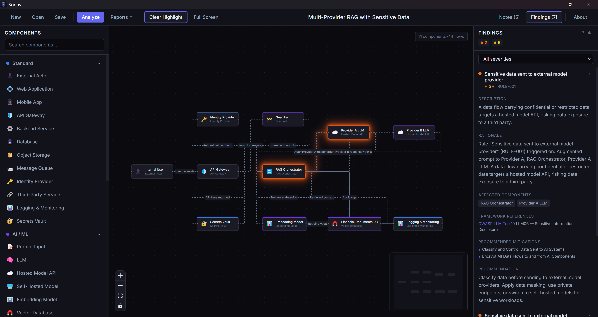

# AI Threat Modeler

**Visual threat modeling for AI systems — available as a web app and a desktop application**

[](https://nshalabi.github.io/ai-threat-modeler/)
[](LICENSE)


[](https://github.com/sponsors/nshalabi)

AI Threat Modeler is a visual threat modeling tool specialized for AI systems, LLM applications, RAG architectures, agents, and model pipelines. It allows security professionals to model AI systems with components, trust boundaries, and data flows, then run automated analysis to identify threats, weaknesses, and recommended mitigations — including **multi-hop attack paths** that compose across components. Findings carry a transparent rule-level derivation and map to source-verified framework references: MITRE ATLAS, OWASP LLM Top 10 (2025), OWASP ML Security Top 10, NIST AI RMF, and NIST CSF 2.0. The tool is fully local — the desktop app is offline-only, and the web app runs entirely in your browser with no data leaving the page.

**Try it now in your browser:** [nshalabi.github.io/ai-threat-modeler](https://nshalabi.github.io/ai-threat-modeler/) — load a bundled sample with one click, no install required. For full features and persistent local files, [download the desktop app](https://github.com/nshalabi/ai-threat-modeler/releases/latest).



## Key Features

- Visual drag-and-drop modeling canvas
- 40+ AI-specific and standard component types
- Trust boundaries and data flow metadata
- Deterministic rule-based analysis engine
- **Multi-hop attack-path detection** — chained attacks that compose across components ([how it works](docs/ATTACK-PATHS.md))
- **Attack-Paths view** — visualize detected chains and probe any asset for control-free paths from untrusted sources
- Transparent findings with rule IDs and a per-condition **"Why this fired"** derivation
- Source-verified framework mapping: MITRE ATLAS, OWASP LLM Top 10 (2025), OWASP ML Top 10, NIST AI RMF, NIST CSF 2.0
- Extensible knowledge packs for frameworks and threats
- Available as a web app (no install) and as a desktop app (Windows / macOS / Linux)
- Local-first — desktop runs fully offline, web runs entirely client-side
- JSON project files (.aitm) with import/export
- PDF, Word, and CSV report generation

## Getting Started

Pick the option that fits how you want to use the tool:

**Try it in your browser** — fastest way to evaluate the tool. No install, no account.

  [https://nshalabi.github.io/ai-threat-modeler/](https://nshalabi.github.io/ai-threat-modeler/)

**Download the desktop app** — recommended for real work. Native file dialogs, persistent recents, and offline by design.

  [Latest release](https://github.com/nshalabi/ai-threat-modeler/releases/latest) — Windows installer + portable, macOS DMG + zip, Linux AppImage + tar.gz.

**Build from source** — for development and contributions.

```bash
git clone https://github.com/nshalabi/ai-threat-modeler.git
cd ai-threat-modeler
npm install
npm run dev        # desktop (Electron) dev mode
npm run dev:web    # web dev server
```

## Sample Projects

The [`samples/`](samples/) directory contains ready-to-open `.aitm` projects that demonstrate common AI architectures and the kinds of findings AI Threat Modeler produces. They are the fastest way to try the tool without building a model from scratch — click **Samples** in the toolbar (works in both the [web demo](https://nshalabi.github.io/ai-threat-modeler/) and the desktop app) and pick one.

| Sample | What it shows |
| --- | --- |
| [`rag-chatbot-public.aitm`](samples/rag-chatbot-public.aitm) | Public-facing RAG chatbot — common AI application attack surfaces (prompt injection, data exfiltration, hallucination handling). |
| [`internal-ai-agent.aitm`](samples/internal-ai-agent.aitm) | Internal enterprise agent with tool access (DB queries, API calls, email) — agent autonomy and over-privileged tool risks. |
| [`multi-provider-sensitive-data.aitm`](samples/multi-provider-sensitive-data.aitm) | Enterprise RAG handling regulated financial data across multiple model providers — data residency, multi-tenant, and provider trust risks. |
| [`ml-training-pipeline.aitm`](samples/ml-training-pipeline.aitm) | Model fine-tuning workflow — training data integrity and supply chain risks. |
| [`rag-indirect-injection.aitm`](samples/rag-indirect-injection.aitm) | Customer-support RAG assistant — realistic design that is well-built on transport/access controls but vulnerable to **indirect prompt injection** through ingested external content. Demonstrates multi-hop attack-path detection. |
| [`minimal-safe-architecture.aitm`](samples/minimal-safe-architecture.aitm) | A hardened reference architecture with recommended controls in place — useful as a contrast to the other samples. |

After opening a sample, click **Analyze** in the toolbar to run the rules engine and see findings mapped to MITRE ATLAS, OWASP LLM Top 10, NIST AI RMF, and NIST CSF.

## Technology

Built with React, TypeScript, React Flow, Zustand, Zod, and Tailwind CSS. Packaged as a desktop app via Electron, and as a static web app via Vite.

## Architecture

The application is organized into four subsystems:

- **Modeling Engine** -- Canvas, node library, and project persistence
- **Knowledge Engine** -- Knowledge packs, framework mappings, and lookup
- **Analysis Engine** -- Single-component and multi-hop path rules, evaluator, and findings
- **Reporting Layer** -- Findings view, Attack-Paths view, and export

See [docs/ARCHITECTURE.md](docs/ARCHITECTURE.md) for the full architecture document.

## Contributing

Contributions are welcome. Knowledge packs and analysis rules are the easiest way to contribute since they are declarative JSON and require no changes to application code.

See [docs/CONTRIBUTING.md](docs/CONTRIBUTING.md) for the contributor guide.

## Knowledge Packs

AI Threat Modeler uses structured JSON knowledge packs to define threats, controls, mitigations, and analysis rules — both single-component rules and multi-hop `pathPattern` rules. References are source-verified against MITRE ATLAS, OWASP LLM Top 10 (2025), OWASP ML Top 10, NIST AI RMF, and NIST CSF 2.0. You can extend the built-in packs or create new ones.

See [docs/KNOWLEDGE-PACKS.md](docs/KNOWLEDGE-PACKS.md) for the authoring guide and [docs/ATTACK-PATHS.md](docs/ATTACK-PATHS.md) for how attack-path detection is evaluated.

## Support the Project

If you find AI Threat Modeler useful in your work, consider supporting its continued development:

- [GitHub Sponsors](https://github.com/sponsors/nshalabi)

Your support helps keep the project maintained and free for the community.

---

## License

Released under the [MIT License](LICENSE) — free to use, modify, and distribute, including commercially. Attribution appreciated but not required.

Copyright &copy; 2026 Nader Shalabi.

## Acknowledgments

This project references content and taxonomy from the following frameworks:

- [MITRE ATLAS](https://atlas.mitre.org/) -- Adversarial Threat Landscape for AI Systems (verified against `mitre-atlas/atlas-data`)
- [OWASP LLM Top 10 (2025)](https://genai.owasp.org/) -- Top 10 risks for LLM applications
- [OWASP Machine Learning Security Top 10](https://owasp.org/www-project-machine-learning-security-top-10/) -- classical-ML security risks
- [NIST AI RMF](https://www.nist.gov/itl/ai-risk-management-framework) -- AI Risk Management Framework 1.0 (verified against the AI RMF Core)
- [NIST CSF 2.0](https://www.nist.gov/cyberframework) -- Cybersecurity Framework 2.0 (verified against the NIST CPRT export)
